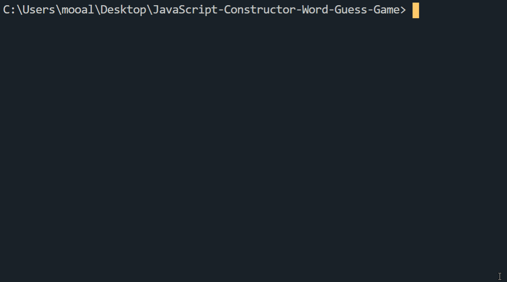

## Constructor Word Guess Game (Advanced Javascript Command Line Word Guess Game)

Constructor Word Guess Game is a command line node app that utilizes JavaScript Constructors, NPM Inquirer.js Packages, Objects, and Node.js.

## Getting Started:
Download the "images" folder to visualize each command.
This will allow you to better see how the game works with each given command.
index.js - This file contains the logic for the course of the game, which depends on Word.js and letter.js.

# Actions:
When asked from the command line, pick a random lower case letter from 'a-z'. After picking a random letter it will display the letter you typed and also a prompt will appear for the number of letter guesses remaining. If correct it will display the word with the letter you guessed filled in. If incorrect, it will reduce the number of incorrect guesses remaining.

## DEMO:

## Technologies & Concepts Used:

* Javascript
* Node.js
* NPM Packages
* Inquirer.js For Interactive Prompting
* Constructor Functions
* Object-Oriented Design
* Asynchronous Programming

    🍀 Good Luck! 🍀

# A Constructor Word Guess Game - Made by Muhammad Ali.
